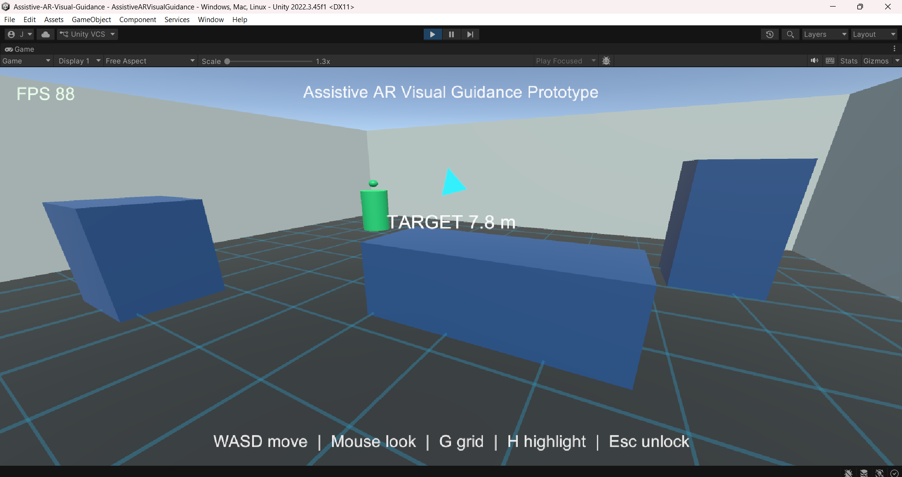

# Assistive AR Visual Guidance

Assistive AR Visual Guidance is a small Unity prototype that simulates an AR-glasses navigation aid for spatial orientation in a clinical room. It is designed as a clean portfolio demo for medical augmented reality research and development work.

## Project Purpose

The project demonstrates how a lightweight AR guidance layer can help a user understand where to move, where an important target is, and how nearby boundaries relate to their current position. The prototype is intentionally simple so the interaction model and code structure are easy to inspect.

## Medical AR Motivation

In medical environments, AR systems can support clinicians, technicians, or patients by presenting spatial cues without requiring them to look away from the real world. A directional target indicator, boundary overlay, and object highlighting can reduce cognitive load during navigation, equipment localization, or guided procedural workflows.

This demo does not claim clinical accuracy. It is a simulation of interaction concepts that could later be connected to real AR hardware, spatial tracking, and validated medical workflows.

## Features

- Simple 3D clinical room with walls, floor, and obstacles.
- First-person AR-glasses camera.
- WASD movement and mouse-look navigation.
- One target object placed in the room.
- Floating HUD arrow that always points toward the target.
- Target distance label.
- Transparent spatial grid and room boundary overlay.
- Grid toggle with `G`.
- Target highlight toggle with `H`.
- On-screen FPS counter.
- Modular C# scripts with focused responsibilities.

## Screenshot



## Demo Video

[Download demo video (MP4)](Media/demo/demo.mp4)

## Controls

- `WASD`: Move around the room.
- `Mouse`: Look around.
- `G`: Toggle spatial grid and boundary overlay.
- `H`: Toggle target highlight mode.
- `Esc`: Unlock the cursor.
- `Left Mouse Button`: Lock the cursor again.

## Tech Stack

- Unity 2022.3 LTS.
- Built-In Render Pipeline.
- C# MonoBehaviour scripts.
- Unity primitive meshes and built-in UI.
- No external packages required.

## Folder Structure

```text
Assets/
  AssistiveARVisualGuidance/
    Scenes/
      AssistiveARVisualGuidance.unity
    Scripts/
      DirectionalTargetIndicator.cs
      FirstPersonController.cs
      FpsCounter.cs
      PrototypeSceneBuilder.cs
      SpatialGridOverlay.cs
      TargetHighlighter.cs
README.md
```

## How To Run

1. Open the project folder in Unity Hub with Unity `2022.3 LTS`.
2. In the Project window, open:
   `Assets/AssistiveARVisualGuidance/Scenes/AssistiveARVisualGuidance.unity`
3. Press the Unity `Play` button.
4. Click inside the Game view if the mouse is not captured.
5. Use `WASD`, mouse look, `G`, and `H` to test the prototype.

## Unity Scene Setup

The scene contains one bootstrap object named `Assistive AR Prototype Bootstrap`. On Play, `PrototypeSceneBuilder` creates:

- A first-person player named `First Person AR User`.
- A camera named `AR Glasses Camera`.
- A simulated clinical room.
- Three obstacle objects.
- A `Navigation Target`.
- A toggleable spatial grid overlay.
- A screen-space HUD with target arrow, distance, controls, and FPS.

This runtime setup keeps the scene lightweight and avoids prefabs or external assets.

## Scripts

- `PrototypeSceneBuilder`: Creates the full prototype scene at runtime.
- `FirstPersonController`: Handles WASD movement, mouse look, gravity, and cursor locking.
- `DirectionalTargetIndicator`: Rotates the HUD arrow toward the target and updates distance text.
- `SpatialGridOverlay`: Builds and toggles the transparent grid and room boundary lines.
- `TargetHighlighter`: Toggles target color/emission and a point light highlight.
- `FpsCounter`: Updates the on-screen FPS readout.

## Limitations

- This is a desktop simulation, not a deployed AR application.
- No real camera passthrough.
- No real-world spatial mapping.
- No real SLAM/VIO tracking.
- No medical device integration.
- No accessibility or clinical validation testing.

## Future Improvements

- Add OpenXR support for AR headset deployment.
- Integrate SLAM/VIO for real-world spatial tracking.
- Add eye tracking for hands-free target selection and attention-aware UI.
- Use real spatial anchors and persistent target registration.
- Add embedded deployment support for mobile or headset-class hardware.
- Add safety validation, calibration workflows, and user study instrumentation.
